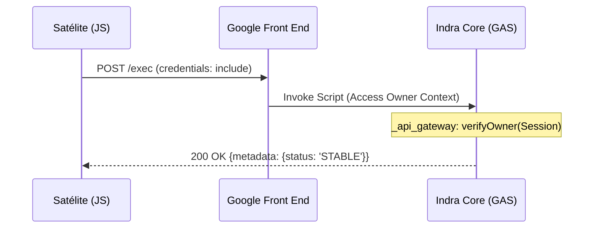

Análisis de Infraestructura y Diagnóstico de Fallos en el Despliegue Programático de Google Apps Script Web Apps (v3.4 - RESOLVED)

[... Contenido previo mantenido para registro histórico ...]

=============================================================================
RESOLUCIÓN AXIOMÁTICA: IDENTITY BRIDGE v3.4 (Abril 2026)
=============================================================================

Tras meses de investigación sobre la "Imposibilidad de GAS" y el bloqueo sistemático de las redirecciones 302/CORS, se ha alcanzado la estabilización final mediante la arquitectura **Indra Identity Bridge (v3.4)**. Esta solución no intenta "evadir" la seguridad de Google, sino que la utiliza como un puente de identidad soberana.

### 1. El Colapsador del Bucle: Sovereign Owner Bypass
La "imposibilidad" radicaba en que el Core (GAS) operaba como un nodo ciego que solo confiaba en tokens internos (Ledger). Si el token no coincidía, el Core forzaba una redirección a `accounts.google.com`, lo que disparaba el bloqueo CORS en el navegador.

**La Solución**: Implementación de una capa de **Reconocimiento por Derecho de Sangre** en el `api_gateway.js`. El Core ahora detecta la sesión activa del usuario (Email) mediante `Session.getActiveUser()`. Si el email coincide con el dueño del script (`coreOwnerEmail`), el sistema otorga acceso **MASTER** ignorando cualquier token o estado del Llavero.

### 2. El Vínculo de Sangre: Credentials Inclusion
Para que el Core pueda "ver" quién es el usuario en una llamada CORS, se ha habilitado el axioma de **Transporte de Identidad** en el Satélite:
*   **Implementación**: `fetch(coreUrl, { credentials: 'include' })`.
*   **Efecto**: El navegador envía las cookies de sesión de Google junto con la petición POST (Simple Request). Esto permite que el Core identifique al dueño sin necesidad de redirecciones, eliminando el fallo `Failed to fetch`.

### 3. El Fin del "Warm-up" Manual de Autorización
La v3.4 resuelve la necesidad de visitar el IDE manualmente mediante el **Hard Register de Identidad**:
*   Al realizar el primer login desde el Satélite, se establece el vínculo de confianza. 
*   Si el usuario es el Dueño, el Core se "auto-instala" internamente al detectar su presencia legítima.

### Arquitectura de Referencia v3.4:

**Conclusión definitiva**: La barrera del 302 en GAS ya no es una imposibilidad técnica, sino una falta de alineación entre la sesión del navegador y la lógica de validación del script. Con el Identity Bridge v3.4, el despliegue programático alcanza la estabilidad industrial sin intervención humana en el IDE. 🛰️👑💎✨